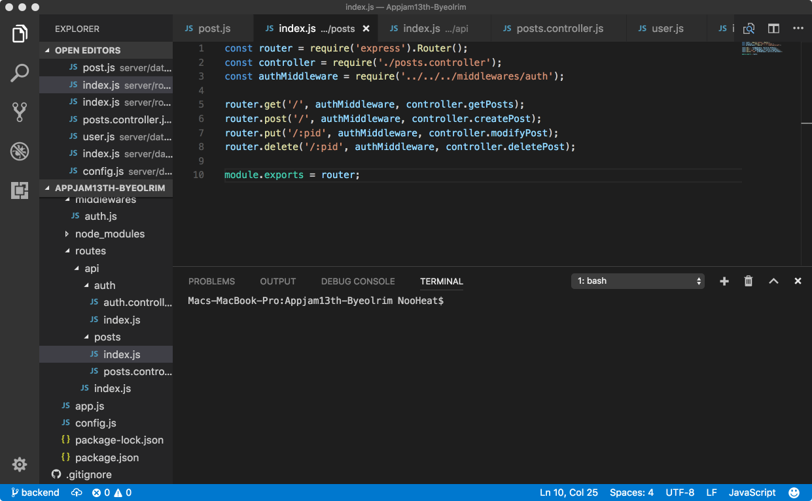
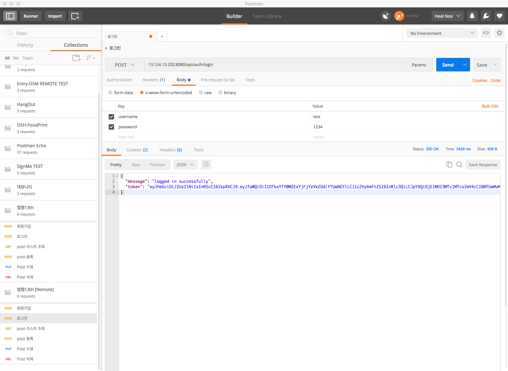
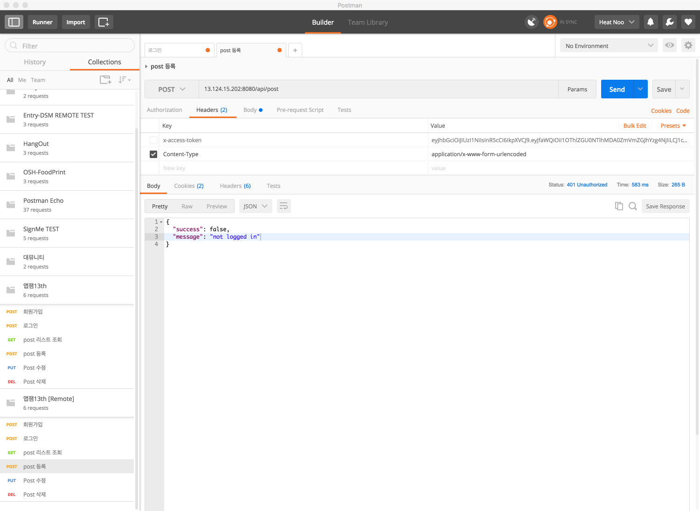
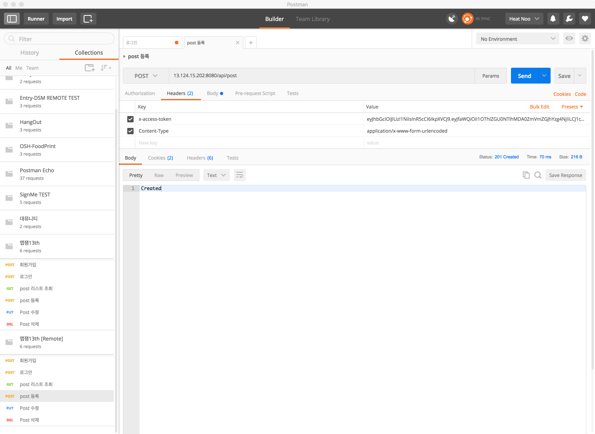

안녕하세요!  
저는 지난 12, 13일 이틀간 제 13회 앱잼 해커톤에 참가했습니다.  
> 앱잼?  
> 서울디지털재단, SK techx, 아산 나눔재단, fluenty, SK telecom에서 주관하는 청소년 무박 2일 해커톤 행사입니다.  
  
이번 앱잼 주제는 **당신의 밤**이었습니다.  
저희가 생각한 아이디어는 ~~조금 식상하지만~~ '감성 다이어리'였고, 로그인하지 않으면 `Realm`로컬 데이터베이스에만 저장해두고, 로그인하면 서버에 백업할 수 있도록 구현하기로 하였습니다.    
  
사용한 기술 스택은 다음과 같습니다.
1. 안드로이드 (1인)  
    - Android Studio  
    - Java  
    - Realm    
2. 서버 (1인)  
    - Node.js  
    - Express  
    - MongoDB

음.. 보셨다시피 서버에서 특별히 할게 없습니다. 로그인, 포스트 CRUD 구현 정도?  
  
그래도 마냥 놀고 먹을수는 없기에 `토큰 기반 인증방식`을 시도해보기로 했습니다.  
이전에 REST API를 공부하면서 
> 'REST의 특징으로 작업을 위한 상태 정보를 따로 저장하거나 관리하지 않는 Stateless(무상태성)가 있고, 이를 위해서 세션을 사용하지 않고 토큰 기반 인증방식을 사용한다.'  

라는 내용을 보고 토큰 기반 인증방식을 사용해보고 싶었으나..  
진행하고있는 프로젝트에 갑작스럽게 세션 대신 JWT기반 인증방식을 도입하기도 힘들고(혼자 진행하는 프로젝트가 아니기 때문에) 당시엔 복잡해보이는 인코딩, 서명 등의 내용 때문에 토큰 기반 인증방식 도입을 미루고 미루기만 했습니다.  
  
**그래서 이번 프로젝트에 JWT(Json Web Token) 인증 방식을 도입해보기로 하였습니다.**  
  
JWT에 대한 자세한 내용은 따로 포스팅하도록 하겠습니다.  
  
로그인에 성공하면 토큰을 반환하고, 로그인을 요하는 요청에 대해서는 이 토큰을 요청헤더에 x-access-token값으로 넣거나, uri query에 token 값으로 넣어야만 동작을 수행하도록 만들었습니다.

  
Auth Middleware를 만들어 로그인이 필요한 요청에 대한 라우팅 미들웨어로 넣고, 토큰 값이 존재하지 않거나 유효하지 않다면 응답코드 401(Unauthorized)을 반환하도록 했습니다.

로그인 성공시 반환된 토큰을 HTTP Request Header의 x-access-token값으로 집어넣지 않으면 로그인이 필요한 요청에 대해서는 거부당합니다.  

**토큰 X**  
  
Status code 401만 반환하는게 더 낫습니다.  
  
**토큰 O**  
  
요청을 수행합니다.  
  
자세한 서버 코드는 [GitHub / Appjam13th-Byeolrim](https://github.com/Nooheat/Appjam13th-Byeolrim)에서 보실 수 있습니다.  
  
감사합니다. (__)

