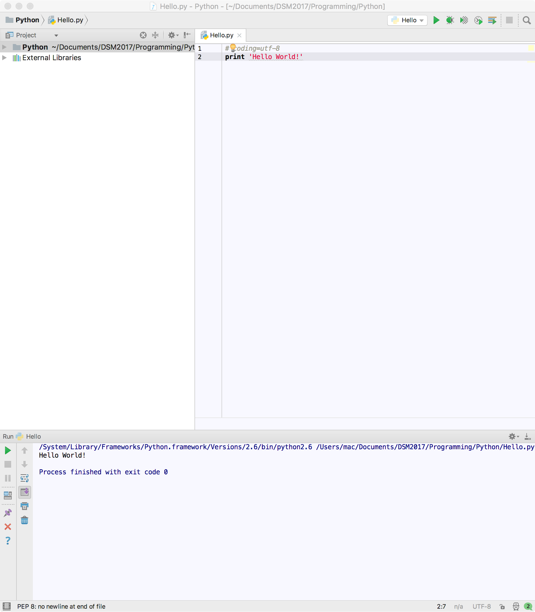

안녕하세요. Terry입니다.  
  
이제 파이썬 공부를 시작해보려고 합니다.  
최근들어 Django, Flask에 관심이 생겨서요.  

사실 작년 겨울에 파이썬을 공부해본 적이 있긴 한데.. 그땐 아무것도 모르고 해서 그냥 다시하려고 합니다.  

  

~~자바가 95%길래 즉석으로 끝내버렸습니다~~  

그래서 오늘 해볼 것은 파이썬 개발환경 세팅입니다.

## MAC OS 파이썬 설치
맥에는 파이썬이 기본적으로 설치되어 있습니다만, 저는 3.6버전을 사용하기위해 [`Homebrew`](https://brew.sh/index_ko.html)를 사용했습니다.  
Linux에는 있지만 Mac OS에는 없는 apt같은 패키지 관리자를 대신해줄 녀석입니다.  
위 링크를 클릭해 brew를 먼저 설치해주신 후  

```
brew install python3
```

이 한 방이면 파이썬 3.6버전이 설치됩니다.
  
## PyCharm 설치
Jetbrains사에서 개발한 Python IDE인 PyCharm을 설치했습니다.  
자매품인 Intellij를 사용하면서 학생 라이센스를 받아놓은 덕에 PyCharm의 여러 부가 기능들도 사용할 수 있게 되었습니다.  
  
[`PyCharm 다운로드`](https://www.jetbrains.com/pycharm/)  
  
## Hello World! 출력하기
PyCharm까지 설치하신 후엔 프로젝트를 하나 만들어주세요.  
(딱히 어려울 것 없습니다.)  
  
**Hello.py** 파일을 생성해주시고, 안에 이렇게 작성해주세요.
```python
print 'Hello World!'
```
실행했을 때 아래 콘솔에 다음과 같이 Hello World!가 출력된다면 성공적으로 세팅이 완료된 것입니다.  


수고하셨습니다. 감사합니다. :)


