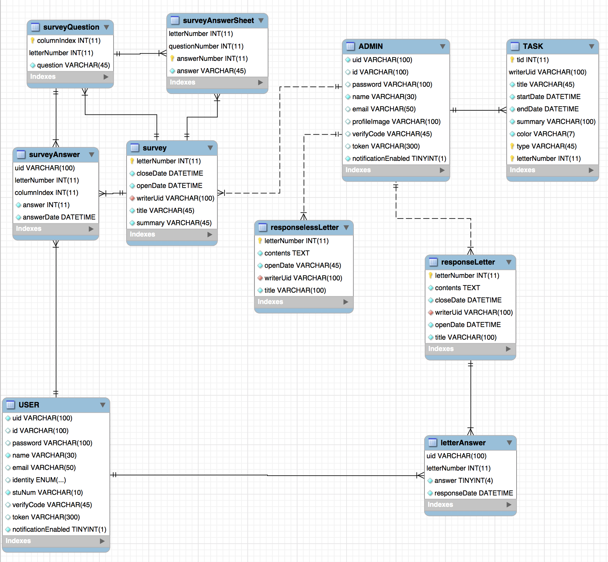
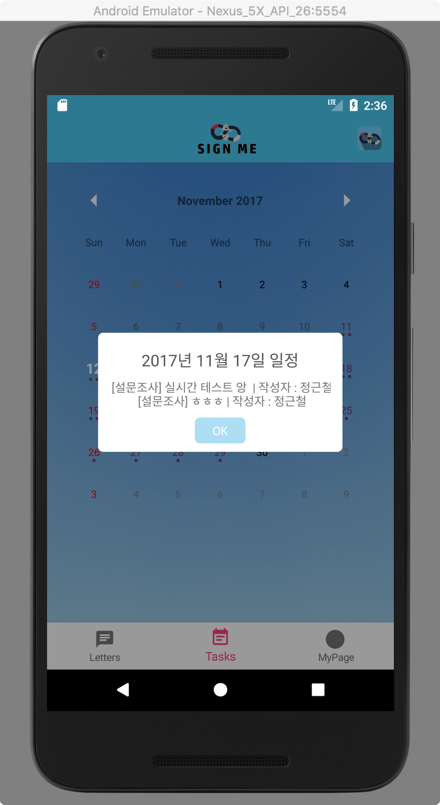

지난 11월 6일 드디어 전공 프로젝트 수행평가가 마무리되었다.  
각 조의 결과물을 1학년 공통과정 학생들과 2학년 소프트웨어개발과 학생들, 그리고 교직원 선생님분들의 앞에서 발표할 기회가 생겼었다.  
  
간만에 올리는 글이라 어색하지만 그동안 프로젝트를 진행하면서 느낀점들, 그리고 결과물에 대해 적어놓고 싶어 vscode를 켰다.  

## SignMe프로젝트?
**가정통신문 온라인 배부/수합 서비스**로서 기존의 복잡했던 가정통신문 배부/수합 과정을 개선시키는 것을 목적으로 한 프로젝트이다.  

## 1. 문제 인식
### 1-1. 현재의 가정통신문 배부/수합 플로우
1. 가정통신문 배부
2. 가정통신문 응답 
    - 분실시 일과중에 가정통신문을 다시 받아야함
3. 학생과 부모님이 수기로 가정통신문 응답.
4. 정해진 날짜에 가정통신문 제출 - 수합
5. 각 반 반장 혹은 담당자가 가정통신문 통계를 내어 선생님께 전달(Optional. 하는 학교도, 아닌 학교도 있다.)
6. 내어진 통계는 담당 선생님께 전송

### 1-2. 현재의 문제점
현재의 가정통신문 배부/수합 방식에는 많은 불편과 문제점이 있다.  

1. 학생이 가정통신문 전달을 까먹거나 가정통신문 자체를 잃어버린다.
2. 가정통신문 분실시 새 종이를 받아야한다.
3. 상당한 양의 종이가 필요하다. (전국단위이므로 상상을 초월하는 양의 종이가 사용된다)
4. 종이 형태로 수합한 가정통신문을 사람이 통계를 내어야한다. (각 반 반장, 담당자 혹은 담임선생님)

## 2. 개선 방향 (서비스 소개)

### 2-1. 새로운 워크플로우
가정통신문 등록, 응답 제출, 통계 과정이 모두 온라인에서 진행된다.  

1. 가정통신문 담당 선생님께서 웹상에서 가정통신문을 등록
2. 별도의 전달과정 없이 학생/학부모가 기한 내 자유롭게 응답/수정 가능
3. 담당 선생님은 실시간으로 응답 현황/응답 통계를 받아볼 수 있음
4. 가정통신문 응답 마감시 담당 선생님께서는 별도의 통계 작업 없이 서버 측에서 내어준 통계자료로 결재 진행

## 3. 개발 내용

### 3-1. 서비스 개발 목표
가정통신문을 등록하고 전산 업무를 처리하시는 선생님들께서는 웹 플랫폼에 친숙하시기 때문에 웹 서비스를, 가정통신문을 언제 어디서나 받아보고 응답할 수 있는 접근성이 필요한 학생/학부모님들에게는 안드로이드 애플리케이션 적합하다고 판단했기 때문에 안드로이드 애플리케이션 개발을 목표로 했다.

### 3-2 개발 기능
#### 가정통신문 담당자
0. 신뢰성있는 회원가입
    - 사전에 고유 키와 기본 정보 (성함 등)을 담은 테이블을 생성
    - 고유 키를 배부하고 키를 통해 회원가입
1. 가정통신문 등록 기능
    - 웹 플랫폼에서 가정통신문 등록 (비응답형, 응답형, 설문조사)
    - 등록된 가정통신문은 바로 캘린더 일정에 등록됨
2. 가정통신문 수정 기능
    - 등록한 가정통신문을 수정
    - 수정시 사용자들의 응답은 모두 삭제
3. 가정통신문 일정 조회 기능
    - 등록된 가정통신문의 전체적인 기한과 일정을 달력 형태로 볼 수 있음
4. 가정통신문 수합 & 통계 기능
    - 사용자들의 응답은 데이터베이스에 수집
    - 수집한 응답을 바탕으로 엑셀 통계를 제공
5. 마이페이지 기능
    - 자신이 등록한 가정통신문 목록
    - 정보 수정 (이름 등)

#### 학생 & 학부모
0. 신뢰성있는 회원가입
    - 사전에 사용자 고유 키와 기본 정보 (이름, 학번)을 담은 테이블을 생성
    - 고유 키를 배부하고 키를 통해 회원가입
1. 처음 사용하는 사용자를 위한 튜토리얼 기능
2. 가정통신문 응답 기능
    - 안드로이드 애플리케이션에서 응답형/설문조사 가정통신문들에 대한 응답을 할 수 있음
3. 가정통신문 응답 수정 기능
    - 가정통신문 응답 기한이 끝나기 전까지 사용자들은 응답을 변경할 수 있음
4. 가정통신문 일정 조회 기능
    - 등록된 가정통신문의 전체적인 기한과 일정을 달력 형태로 볼 수 있음
5. 기타 계정 정보 수정 기능
    - 개인정보 수정 기능 (이름 등)
6. 푸시 알림 기능
    - 등록된 가정통신문의 응답 기한이 얼마 남지 않은 경우, 해당 가정통신문에 응답하지 않은 사용자에게 푸시알림
    - 계정 정보 수정 창에서 푸시알림 On/Off 가능

### 3-3. 개발 역할 & 기술 스택
#### 3-3-1. 개발 역할

이름 | 역할 | 기타 
---|---|---
길상우 | 웹 프론트엔드 | 
김수민 | 디자인 | 발표자료 제작
윤태훈 | 백엔드, 안드로이드 | 데이터베이스 설계, 발표
홍소망 | 안드로이드 |

#### 3-3-2. 기술 스택

분야 | 기술 | 사용 툴 | 기타
---|---|---|---
안드로이드 | Android (Java) | Android Studio | 
웹 프론트엔드 | HTML, CSS, JavaScript(JQuery) | Visual Studio Code | 
백엔드 | Java - Vertx 프레임워크, MySQL | Intellij | 

### 3-4. 데이터베이스 설계
대체적으로 초반 설계대로 개발이 진행되었지만, 중간중간 필요해 의해 테이블이나 칼럼을 추가하는 경우 **리버스 엔진**을 통해 구조를 다시 뽑았다.  

## 4. 개발 결과물
### 가정통신문 담당자 (웹 서비스)
0. 메인페이지

1. 가정통신문 리스트

현재 등록된 가정통신문을 보여줌, 카테고리별로 볼 수 있음
3. 가정통신문 등록
    - 가정통신문 종류 선택
    
        - 응답형 설문조사 : 5개의 항목을 가지는 설문지 (만족도조사 등)
        - 응답형 가정통신문 : YES OR NO를 응답으로 가지는 가정통신문 (급식 신청서 등)
        - 비응답형 가정통신문 : 정보 전달을 목적으로하는 가정통신문
    - 가정통신문 등록 (설문조사)
    
    - 가정통신문 등록 (응답형)
    
    - 가정통신문 등록 (비응답형)
    
3. 가정통신문 일정

    전체 가정통신문 일정을 한 눈에 볼 수 있도록 했다.  
    주, 일 단위로도 볼 수 있다.
4. 마이페이지

5. 가정통신문 통계  
    가정통신문에 대한 통계를 제공하는데, **.xlsx 엑셀** 포맷으로 제공한다.  
    통계와, 세부 통계로 나뉜다.  
    구현은 응답형 가정통신문과 설문조사 모두 다 했지만 설문조사만 올리기로 헀다.
    - 통계  
    응답 개수, 동향 등의 내용을 담고있다.
    
    - 세부통계  
    **응답 내용을 정리**해놓은 통계이다.
    

### 학생/학부모 (안드로이드 어플리케이션)
1. 로그인
    - 로그인 성공시 발급된 JWT Token은 SharedPreference에 저장된다.
    - 로그인 화면
    
2. 메인 화면 (가정통신문 목록)
    - 첫 진입시 보이는 화면이다. **Letters** 탭에 생긴 BottomNavigationBar는 스크롤을 아래로 내리고 있을 때엔 사라진다.
    - 메인화면
    
3. 가정통신문 응답(수정)
    - 응답이 가능한 경우 : 응답 화면으로 넘어가 정상적으로 처리한다. 사진은 설문조사 응답 화면이다.
    
    - 이미 응답한 가정통신문의 경우 : 응답 화면으로 넘어가기 전 이미 응답했음을 확인시켜준다. 응답 수정의 역할을 한다.
    
    - 응답 기한이 지난 가정통신문의 경우 : 응답할 수 없도록 한다.
    
4. 마이페이지  
    개인정보 수정, 로그아웃, 회원탈퇴, 푸시알림 On/Off가 가능하다.
    
5. 가정통신문 일정
    가정통신문 일정이 있는 날에는 날짜 밑에 점이 찍히고(최대 3개) 해당 날짜를 눌러 자세한 내용을 볼 수 있다.
    
    
6. 푸시 알림  
    등록된 가정통신문의 마감 시간까지 1시간도 채 안남았다면 응답하지 않은 학생/학부모님들에게 푸시알림을 전송한다.  
    
    
## 5. 프로젝트를 통해 얻은 것

### Vertx 프레임워크 사용
우선 처음으로 **Vertx** 프레임워크를 써보았다. 큰 이유가 있어서 사용한건 아니었다. Java 수업 시간엡 팀 프로젝트를 명목으로 진행한 것이었기 때문에 Java를 이용한 서버를 만들어야했기 때문이다.  
**Spring**, **Netty**등을 사용할 수도 있었지만 당시 Vertx가 쉽다는 소리를 듣기도 했고, 무엇보다 이름이 마음에 들었다.  
아마 언어 제한이 없었다면 **Node.js**에 **Express** 프레임워크를 사용해서 구현했을 것 같다.  
  
하지만 Vertx를 사용하면서 굉장한 삽질을 해댔고 이 덕분에 내 스스로가 성장함을 느꼈다.  
  
### JWT(JSON Web Token) 경험
어노테이션을 이용해서 요청 처리를 클래스단위로 할 수 있도록 해주는(Spring에서 @URLMapping 어노테이션을 이용하듯?) `nubes`라는 라이브러리를 사용하려했는데, 세션 핸들링이 안되는 문제가 발생했다.  
이런저런 삽질을 거듭한 끝에 내린 결론은 **JWT를 한 번 써보자**였다.  
RESTFul API에 대해 공부하다 알게된 Stateless(무상태성)라는 용어. 그리고 이걸 만족시킬 수 있는 토큰 기반 인증방식인 JWT를 한 번 사용해보고 싶었다.  
  
이곳저곳 많은 블로그를 찾아보고 (ZeroCho, 조대협님 블로그 등등) JWT에 대한 개념을 먼저 익힌 후 [jjwt](https://github.com/jwtk/jjwt)라는 라이브러리를 사용해 구현하기로 했다.

다음과 같은 코드를 작성해 JWT 토큰을 만들어 쿠키로 반환했다. 엄청난 오점이 있지만 이따가 언급하기로 하겠다.  
  
친구와 발급된 JWT 토큰을 어디에 저장하느냐를 가지고 토론을 하기도 했다.

### 첫 PM 경험
난생 처음으로 프로젝트 매니저라는 위치에서 프로젝트를 진행했다.  
프로젝트를 처음 시작할 때만 해도 갓 백엔드로 진로를 잡은 햇병아리에 프로젝트를 한 번도 진행해본 적이 없었기 때문에 처음 진행하는 프로젝트 그 자체만으로도 부담이었다. 게다가 역할이 PM이라니. 미칠 지경이었다.  
그 당시 내 머리속에 든 생각은 단 하나였다.

> 나 하나 때문에 프로젝트가 망하면 어떡하지?  

내가 PM을 맡을 만한 실력이 있는 사람일까?, 나 하나 건재하기도 벅찬데 이런 역할을 왜 맡았지?하는 생각도 동반했다.  
물론 PM 역할을 맡은건 자의가 아니었다. Java 프로젝트 팀 빌딩 전에 선생님께서 팀 밸런스를 어느정도 맞추겠다시곤 간단한 테스트를 보게 하셨다. 거기서 조장을 맡게됐다.  
어찌됐건 엄청난 부담이었다.  
  
처음엔 잘해보고자 Slack, Asana도 도입하고 Asana 사용법을 영상으로 찍어서 보내주는 등 적극적인 참여를 유도하려 노력했지만 팀원들이 생각만큼 잘 따라주진 않았다. 탓하는건 아니다.  
  
인적/물적 자원 관리도 어떻게 해야할지 몰랐고 전체적인 프로젝트 진행 상황도 잘 파악하지 못했던 못난 PM이었지만 프로젝트를 끝까지 함께해준 세 친구들에게 진심으로 고마운 마음이다.  

**갖가지 시행착오를 거쳤지만 지금와서 돌이켜보면 이런 과정이 있었기에 프로젝트 전보다 더 성장할 수 있지 않았을까 싶다.**  

### MySQL 공부
쿼리문을..잘은 못 짰지만 그래도 열심히 공부했다.  
데이터베이스 수업시간에 **COMMIT**과 **ROLLBACK**에 대해 배워 기존 소스에 적용했다.  
전부터 "2개 이상의 쿼리문을 실행해야하는 로직 상에서 두 번째 쿼리문에서 오류가 발생했을 때 첫 번째 쿼리문을 되돌려야할텐데?" 하는 생각을 가지곤 있었지만 알아보려는 노력을 하지 않았었기 때문에 이렇게 간단한 개념을 놓치고 넘어갔다는 점이 부끄러웠다.  

### Smarteen App Challenge (STAC) 참가
거의 혼자 문서를 작성해 STAC 예선전에 냈다. 우리 프로젝트가 나름 괜찮은 아이디어라고 생각했는데 STAC의 니즈와는 조금 달랐나보다. 예선탈락했다. 하지만 신청서는 아직도 가지고있다.  

### 안드로이드 경험
안드로이드 파트의 개발이 너무 더뎌 안드로이드 개발을 돕기 시작했다.  
올해 초만 해도 안드로이드를 공부하다가 어려워 포기했는데, 역시 마감일이 다가오니 절박해졌다.  
소스를 짜다보니 안드로이드의 라이프사이클을 이해하게되었고, GitHub에서 예쁜 레이아웃 라이브러리를 가져다쓰는 수준까지 늘었다. 안드로이드 시작 1주일만에 일어난 일이다. 절박하니 무엇이든 할 수 있었다.  
**material-calendarview** Decoration의 점 개수가 최대 1개였는데 코드를 조금 조작해서 최대 3개까지 찍을 수 있게 개조하기도 했다. 잔재주였지만 나름 뿌듯했다. ㅋㅋㅋ 자세한 내용은 링크에서 확인해볼 수 있다.[Facebook 게시글](https://www.facebook.com/permalink.php?story_fbid=507999969558530&id=100010455944037)
그래도 덕분에 안드로이드 개발자와의 소통에 있어서 막히는 부분이 없어진 것 같다. Retrofit2를 사용해본 덕도 컸다.  

### FCM 사용 (안드로이드, 백엔드)
**FCM(Firebase Cloud Messaging)**을 처음 사용해보았다.  
FCM Push Notification 기능을 사용했는데, API 호출시 리퀘스트 바디 키값을 몰라 헤맸었다.  
그리고 어플리케이션이 꺼져있어야 푸시알림이 수신된다는 사실을 몰라 헤매기도 했다.  

## 6. 아쉬운점

### 팀 빌딩
소프트웨어개발과 진학 후 새로 만난 친구들의 성향을 파악할 틈도 없이 프로젝트에 돌입했다.  
말도 몇번 섞어보지 못한 아이들과 팀빌딩을 해야하는게 쉽지 않았고, 서로의 성향을 파악할 시간을 가진 후 서로가 하고싶은 분야의 개발을 할 수 있도록 팀빌딩을 할 시간을 가졌다면 좋지 않았을까 싶다.

### 프로젝트에 대한 관심의 부재
팀원 전체가 프로젝트에 대해 그다지 관심을 가지지 않고 있었다.  
발표가 가까워지자 발등에 불이 떨어진듯 분주하게 움직이기 시작했다. 부끄럽다.  

### JWT에 대한 안일한 생각
앞서 언급했듯 나의 JWT로직에는 엄청난 오점이 숨겨져있었다.  
**만료(Expiration)**를 생각하지 않고 구현한 것이다.  
자세한 내용은 [페이스북 게시글 댓글](https://www.facebook.com/permalink.php?story_fbid=511249602566900&id=100010455944037)에있다.  

## 마치며
- 그래도 잃은 것보단 얻은게 많은 프로젝트였던 것같다.  
- 정리하는데에만 3일가량이 걸렸다.. 적었다 지웠다를 수십번.. 뺴빼로데이에 쓰기 시작해서 13일에 마쳤다.  
- 프로젝트를 계속 진행해서 교내에서 시범운영이라도 해보고싶은데 팀원은 그럴 생각이 없는것같아 아쉽다.  
  

**이걸로 상탈 때까지 밀고나갈거야!!!!!**

---
- [GitHub - SignMe](https://github.com/Nooheat/SignMe)